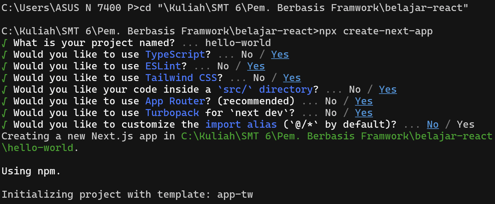

This is a [Next.js](https://nextjs.org) project bootstrapped with [`create-next-app`](https://nextjs.org/docs/app/api-reference/cli/create-next-app).

## Kinata Dewa Ariandi   TI 3C   2241720087

### Praktikum 1
1. Git: Digunakan sebagai sistem kontrol versi yang membantu dalam mengelola perubahan kode secara efisien. Dengan Git, kita dapat menyimpan, melacak, dan berkolaborasi dalam pengembangan perangkat lunak melalui repositori lokal maupun layanan seperti GitHub.

-   VS Code: Merupakan text editor yang digunakan untuk menulis, mengedit, dan menjalankan kode dengan berbagai fitur seperti debugging, integrasi Git, dan ekstensi yang mendukung berbagai bahasa pemrograman.

-   Node.js: Sebuah runtime JavaScript yang memungkinkan kita menjalankan kode JavaScript di luar browser. Node.js berguna untuk membangun aplikasi backend, menjalankan skrip otomatisasi, serta mengelola dependensi proyek menggunakan npm (Node Package Manager).

2. Github : 

-   vscode : 

-   Node.js : 

### Praktikum 2
1. ### Praktikum 1
1. Git: Digunakan sebagai sistem kontrol versi yang membantu dalam mengelola perubahan kode secara efisien. Dengan Git, kita dapat menyimpan, melacak, dan berkolaborasi dalam pengembangan perangkat lunak melalui repositori lokal maupun layanan seperti GitHub.

-   VS Code: Merupakan text editor yang digunakan untuk menulis, mengedit, dan menjalankan kode dengan berbagai fitur seperti debugging, integrasi Git, dan ekstensi yang mendukung berbagai bahasa pemrograman.

-   Node.js: Sebuah runtime JavaScript yang memungkinkan kita menjalankan kode JavaScript di luar browser. Node.js berguna untuk membangun aplikasi backend, menjalankan skrip otomatisasi, serta mengelola dependensi proyek menggunakan npm (Node Package Manager).

2. Github : 

-   vscode : 

-   Node.js : 

### Praktikum 2
1. Istilah : 
- TypeScript : Superset JavaScript dengan tipe statis untuk kode lebih aman.
- ESLint : Alat analisis kode untuk memastikan kualitas dan konsistensi.
- Tailwind CSS : Framework CSS berbasis utility untuk styling cepat.
- App Router : Sistem routing Next.js berbasis folder app/, lebih efisien.
- Import Alias : Mempermudah impor file dengan path pendek.
- Turbopack : Bundler cepat berbasis Rust untuk optimasi Next.js. 
2. #### Folder:
- .next : Folder build yang dibuat secara otomatis oleh Next.js saat proyek dikompilasi.
Berisi output build dan cache untuk meningkatkan kinerja aplikasi.
- node_modules
Folder yang berisi dependensi proyek yang diinstal melalui npm install atau yarn install.
- public
Tempat menyimpan aset statis seperti gambar, ikon, dan file lainnya yang bisa diakses langsung melalui URL.
- src
Direktori utama untuk menyimpan kode sumber aplikasi.
src/app/Folder khusus yang digunakan dalam arsitektur Next.js (App Router) untuk menangani halaman dan layout.
#### File dalam src/app/:
- favicon.ico
Ikon yang digunakan di tab browser.
- globals.css
File CSS global untuk styling seluruh aplikasi.
- layout.tsx
Komponen layout utama yang biasanya membungkus seluruh halaman dan berisi elemen UI yang konsisten, seperti header dan footer.
- page.tsx
Halaman utama dalam arsitektur Next.js berbasis App Router (/ route).
File Konfigurasi dan Lainnya:
- .gitignore
Menentukan file atau folder yang harus diabaikan oleh Git.
- eslint.config.mjs
Konfigurasi untuk ESLint guna memastikan kualitas kode.
- next-env.d.ts
Deklarasi tipe untuk Next.js dalam TypeScript.
- next.config.ts
Konfigurasi khusus untuk Next.js, seperti pengaturan domain gambar, API, dan optimasi.
- package-lock.json & package.json
- package.json: Berisi daftar dependensi proyek dan skrip npm.
- package-lock.json: Mengunci versi dependensi agar proyek tetap konsisten.
- postcss.config.mjs
Konfigurasi untuk PostCSS, yang sering digunakan dengan Tailwind CSS.
- README.md
Dokumentasi proyek.
- tailwind.config.ts
Konfigurasi untuk Tailwind CSS, termasuk tema dan kustomisasi style.
- tsconfig.json
Konfigurasi TypeScript untuk proyek ini.

3. Hasil ss : 

### Praktikum 3

### Praktikum 4
1. untuk menampilkan gambar pada URL
2. ss hasil : 

